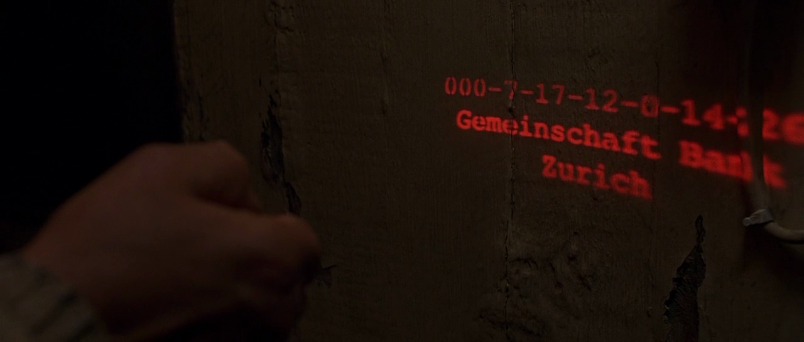

# Crear "monedero"

!!! note "Conceptos importantes:"
    Monederos, cuenta, claves privadas. Relacionar con la tarjeta de débito, el pin y el chip.

## Cuenta

El wallet con la clave privada puede generar, al menos, una clave pública.  

## Instalar Metmask

Ir a la [página oficial y descargar](https://metamask.io/). En Chrome, Firefox, Brave y Edge.

## Contraseña

La contraseña que pide Metamask es como el PIN de la tarjeta de crédito.

## Clave y semilla

Las doce palabras que verás en la instalación (seed phrase) son un nemotécnico de la clave privada, algo legible 
por un humano, que representa un número binario muy largo. Una de las cosas más importantes que hay que entender es 
que esas palabras son tu dinero y tu identidad.

¿Recordáis la primera película de Jason Bourne? O cualquiera de espías, las historias de las cuentas bancarias 
suizas, solo con saber el número te daban el dinero porque no guardaban información de quién eras. No suele ser buen 
plan tener el nombre de un político corrupto asociado a un número.

{ align=left }

Jason solo tuvo que dar ese número 000-7-17-12... y pudo abrir una caja de seguridad.

Tu seed phrase es ese número. Pero tiene la ventaja de que puede generar un número de cuenta, que lo puedes dar, pero 
que no se puede utilizar para sacar el dinero o firmar en tu nombre. Lo puedes dar para recibir dinero, pero a 
diferencia de un banco tradicional todo el mundo verá lo que tienes, lo que recibes, de quién. Además, todo lo que 
esté publicado con ese número de cuenta habrá sido "firmado" por tí (en web de confianza).

## Cuenta

A diferencia de lo que se suele pensar ni Bitcoin, ni Ethereum son anónimos, son pseudónimos. Como todas las 
transacciones son públicas y muchos agentes piden KYC es muy fácil vincular tu identidad a esa cuenta por lo que no 
es para nada un sistema anónimo. Lo iremos viendo.

## Simil con una tarjeta de crédito y DNI.

- El número de la tarjeta de crédito es la cuenta 0x0.......
- La contraseña del monedero es el PIN
- El seed, las doce palabras, están dentro del chip de la tarjeta, nunca las ves.
- El dinero no está en el wallet, como no está en la tarjeta. El wallet y la tarjeta, con sus claves privadas, dan 
  permiso al banco o blockchain (firman transacciones) para hacer algo. 
- Se puede hacer la misma analogía con el DNI electrónico o el certificado digital.
- La diferencia más importante entre de las tarjetas, los certificados, el DNI y es que tu puedes crear esa 
  identidad, no hay un "emisor".
- La otra diferencia es que ese emisor mantiene una relación entre tu nombre y ese número de cuenta. No sabe tu 
  clave privada, pero conoce el vínculo entre cuenta y persona física.

## Configurar Polygon

Ahora tenemos que agregar la red de polygon. En la [documentación oficial](https://docs.polygon.technology/docs/develop/metamask/config-polygon-on-metamask/) hay dos métodos, usaremos el más sencillo 
que es ir a [polygonscan](https://polygonscan.com/) y agregar la red con el ícono que hay al final de la página.

!!! note "Conceptos importantes:"
    Monederos, cuenta, claves privadas. Relacionar con la tarjeta de débito, el pin y el chip.

