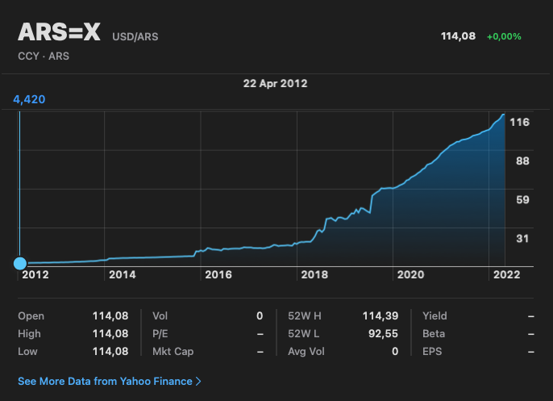

# Impacto medioambiental, ética, política y estafas (debate)

- Crear o participar en una economía basada en criptomonedas es un acto político.
- Privacidad, Cyberanarquismo y todo lo que no es Bitcoin (ni Ethereum)
- Consumo energético de POW
    - A favor, energías renovables
    - En contra: kWh del minado
- Redes POS, sus ventajas en el consumo y sus riesgos de centralización
- [Why Argentina is embracing cryptocurrency](https://www.bbc.com/news/business-60912789). Sí, en el mundo crypto hay
  estafas, pero hay estados que, aun con recursos casi ilimitados, sistemáticamente demuestran su incapacidad de
  gestion, sin importar el partido que gobierne.

- Pagar impuestos es subvencionar ejércitos... también la seguridad social.
- DAOs
- JPMorgan ahora es pro-crypto

Nota: estás páginas ahora son más un guión para la charla que una documentación. 