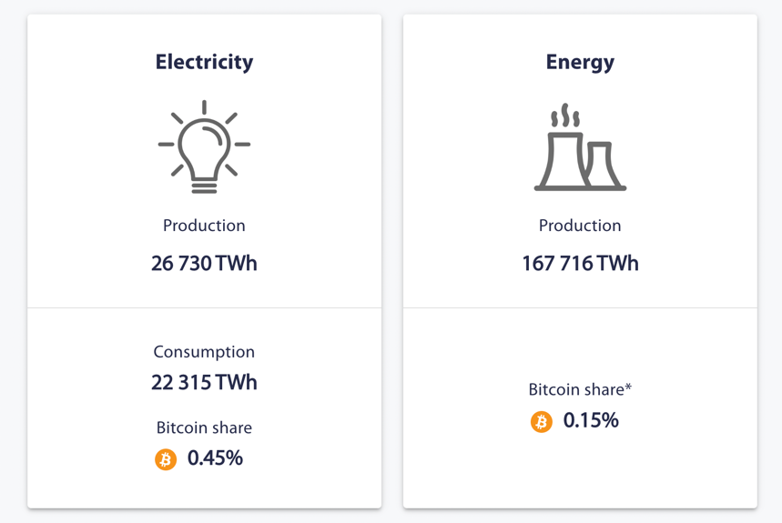
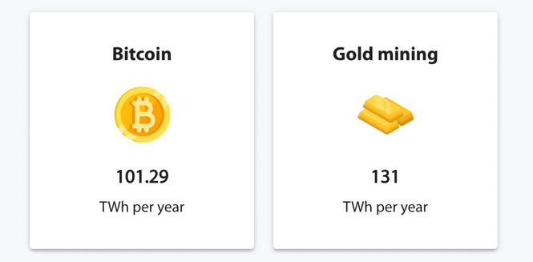
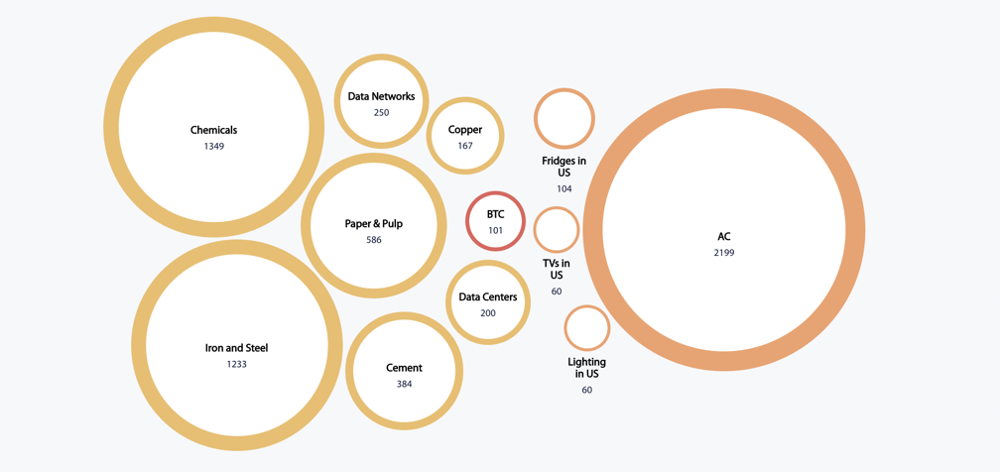
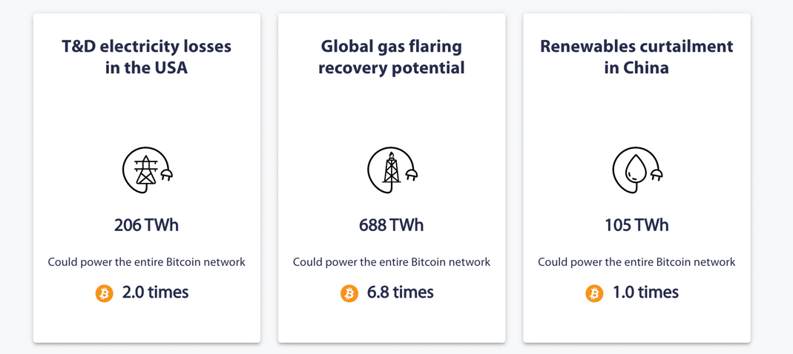
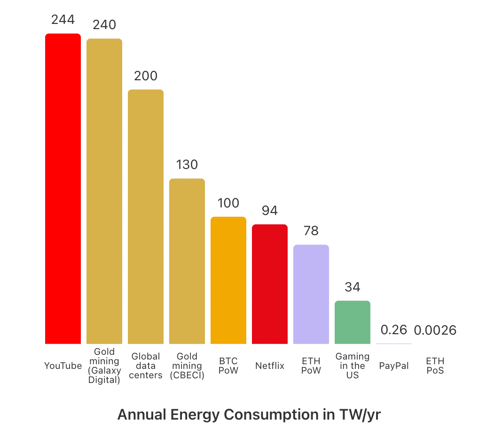

# Impacto medioambiental, ética, política y estafas (debate)

- [El Manifiesto Criptoanarquista](https://es.wikisource.org/wiki/El_Manifiesto_Criptoanarquista) Timothy C. May - 1988
- [Declaración de independencia del ciberespacio](https://es.wikisource.org/wiki/Declaraci%C3%B3n_de_independencia_del_ciberespacio) John Perry Barlow - 1996
- [Export of cryptography from the United States](https://en.wikipedia.org/wiki/Export_of_cryptography_from_the_United_States)
- Crear o participar en una economía basada en criptomonedas es un acto político.
  - Pagar impuestos es subvencionar ejércitos, y también la seguridad social.
- JPMorgan ahora es pro-crypto
- Privacidad, Cyberanarquismo y todo lo que no es Bitcoin (ni Ethereum)
- Consumo energético de POW
    - A favor, energías renovables
    - En contra: kWh del minado
    - [Cambridge Bitcoin Electricity Consumption Index](https://ccaf.io/cbeci/index)
      - Cambridge no es una fuente pro-bitcoin.
      - Total World Production & Consumption 
      - Industrial & Residential   
      - Loss & Waste 
      - En resumen, en el peor de los casos BTC implica el 0.15% de la energía mundial, es menor a la energía utilizada para la extracción del oro, y solo con utulizar el "gas flaring in North America" podríamos dar energía a 6.8 redes de bitcoin.
    - [Otros estudios](https://coinshares.com/research/bitcoin-mining-network-2022) pone el consumo total de Bitcoin en 0.05% de la energía global. 
    - Y [según algunos](https://ethereum.org/en/energy-consumption/), YouTube consume más que Bitcoin. 
    - Ethereum, al pasar a PoS, baja a 0.0026 TWh.
- Redes POS, sus ventajas en el consumo y sus riesgos de centralización.
- [Why Argentina is embracing cryptocurrency](https://www.bbc.com/news/business-60912789). Sí, en el mundo crypto hay
  estafas, pero hay estados que, aun con recursos casi ilimitados, sistemáticamente demuestran su incapacidad de
  gestion, sin importar el partido que gobierne. 

- Proyectos que agregan valor usando blockchain: ETH, HNT, MYST
- Distribuir siempre es buena idea, pero tiene que hacerse bien. El 51% de los ordenadores de consenso pueden controlar el
  blockchain ¿qué pasaría si los mineros de Bitcoin estuvieran todos en un único pais o zona política?

  

- DAOs

!!! note "Nota:"
    Estás páginas ahora son más un guión para la charla que una documentación. Iran mejorando según vayamos avanzando en los
    debates.

