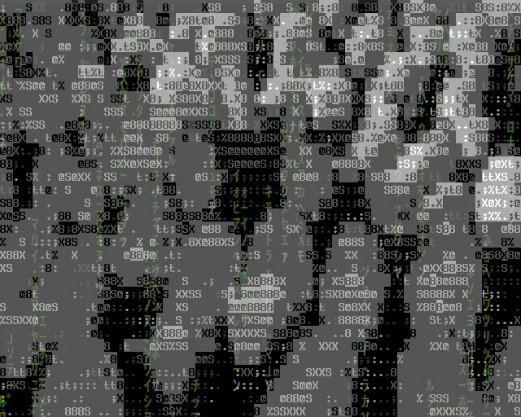
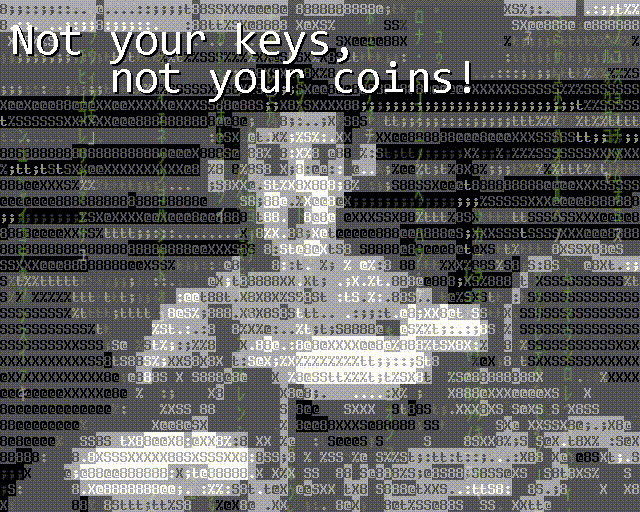

# Colección: Conceptos NFT para Artistas

La vida de una pareja de artistas se entrelaza con la deshumanización de una industria abocada a la automatización sin límites, en una sociedad reprimida y llena de procesos kafkianos, pobreza y desempleo. 

Mientras tanto, las  máquinas han evolucionado y la fuerza de la vida ha entrado en ellas también. El error las hará nacer y el amor evolucionar. 

Al final, "el futuro no está escrito". El amor es el único camino, compartir y construir juntos.

[@ OpenSea](https://opensea.io/collection/nft-para-artistas?search[sortAscending]=true&search[sortBy]=CREATED_DATE)

## Origen de la idea
Tiempos Modernos = la búsqueda de la felicidad, la lucha de una pareja de artistas, la tiranía de la automatización y la
productividad, una crisis nerviosa, droga, encarcelados por manifestarse (aunque no lo estuviera haciendo), el
azar, estereotipos sociales, desempleo, pobreza, crisis económica. Al final: futuro, esperanza y amor.

Ghost in the Shell = ciberpunks, ciberseguridad, control policial, vida artificial, software que nace, desarrolladores
que pierden el control de su código y también al final: futuro, esperanza y amor.

Terminator = I) "The storm is coming" II "The unknown future rolls towards us"...

### Modern times (1936)

_"Modern times." A story of industry, of individual enterprise - humanity crusading in the pursuit of happiness._

### Ghost in the shell (1995)

_En el futuro próximo, redes corporativas llegan a las estrellas. Los electrones y la luz fluyen por todo el universo.
No obstante la informática aún no ha acabado con las naciones y los grupos étnicos._

### Charlie Chaplin

**Description:** Subjected to the infernal production rate of the factory, a model worker suddenly has a nervous
breakdown and goes mad. From hospital, to prison, to unemployment, the Little Tramp gets caught up in the sprockets and
cogs of modern industrialization. That is, until he comes across a beautiful orphaned gamine, whom he helps escape from
the police. How to break free from the constraints of modern life? Chaplin provides a critical look at productivity in
the early 20th century… and well beyond!

[Web oficial de la película](https://www.charliechaplin.com/en/films/6-Modern-Times)

[Filming Modern Times](https://www.charliechaplin.com/en/biography/articles/6-Modern-Times)

“Modern Times” evolved into a comedy that embraces difficult subjects such as strikes, riots, unemployment, poverty, and
the tyranny of automation.
[Jeffrey Vance](https://www.loc.gov/static/programs/national-film-preservation-board/documents/modern_times.pdf)

“Buck up – never say die! We’ll get along!” The movie ends with one of the most beautiful scenes ever caught of camera,
as the couple walks arm in arm with a smile on their face towards the unknown future with hopes in their heart.
[MoumitaGhorai](https://moumitaghorai.wordpress.com/2015/07/27/modern-times-chaplins-satirical-masterpiece-on-the-great-depression/)

## Configuración de la colección en OpenSea

## NFTs

### 00_01_13.gif

[{ loading=lazy }](https://opensea.io/assets/matic/0x2953399124f0cbb46d2cbacd8a89cf0599974963/11780915356901891937150191052604117223978980698243640119023280875073959887848)

### 00_01_18.gif

[{ loading=lazy }](https://opensea.io/assets/matic/0x2953399124f0cbb46d2cbacd8a89cf0599974963/11780915356901891937150191052604117223978980698243640119023280876173471515624)

### 00_01_48.gif

{ loading=lazy }

### 00_02_41.gif

{ loading=lazy }

### 00_03_05.gif

{ loading=lazy }

### 00_05_12.gif

{ loading=lazy }

### 00_12_38.gif

{ loading=lazy }

### 00_19_04.gif

{ loading=lazy }

### 00_20_51.gif

{ loading=lazy }

### 00_21_38.gif

{ loading=lazy }

### 00_22_34.gif

{ loading=lazy }

### 00_27_51.gif

{ loading=lazy }

### 00_28_07.gif

{ loading=lazy }

### 00_28_13.gif

{ loading=lazy }

### 00_29_58.gif

{ loading=lazy }

### 00_38_38.gif

{ loading=lazy }

### 00_40_07.gif

{ loading=lazy }

### 00_48_46.gif

{ loading=lazy }

### 00_55_50.gif

{ loading=lazy }

### 01_00_33.gif

{ loading=lazy }

### 01_06_10.gif

{ loading=lazy }

### 01_16_49.gif

{ loading=lazy }

### 01_22_24.gif

{ loading=lazy }

### 01_22_30.gif

{ loading=lazy }

### 01_22_40.gif

{ loading=lazy }

### 01_23_00.gif

{ loading=lazy }

## Así se han creado los NFTs del taller

[Aquí](howto.md) puedes ver algunos detalles de cómo se hicieron los NFTs.